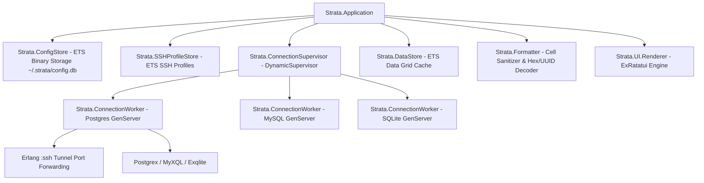

# strata 🗄️ — Modern Terminal Database Manager

[](LICENSE)
[](https://elixir-lang.org/)
[]()

`strata` is a standalone, high-performance **Database TUI Manager** (Terminal User Interface) built for modern terminal workflows.

It combines intuitive database management features (PostgreSQL, MySQL, SQLite, SSH Tunneling, Schema Tree, Multi-Tab SQL Editor, Dual-Mode Data Grid, and Cell Detail Inspector) with smooth **60 FPS** rendering and ultra-lightweight RAM usage (**~25MB - 50MB**) powered by Elixir OTP and the Rust Ratatui NIF engine.

---

## ✨ Key Features

- 🔌 **Multi-Driver Database Support**: Direct connection support for **PostgreSQL** (`Postgrex`), **MySQL/MariaDB** (`MyXQL`), and **SQLite** (`Exqlite`).
- ⚡ **Zero-Latency ETS Binary Config Storage**: Synchronized binary ETS storage (`:ets.tab2file` / `:ets.file2tab`) at `~/.strata/config.db` (with JSON fallback), ensuring zero-latency configuration loading.
- 🗂️ **Browsing vs Select Modes DataGrid**:
  - 📜 **Browsing Mode (Default)**: Clean text display without cursor highlights interfering with content. Instant top-first data scrolling via arrow keys or mouse wheel without layout shifts.
  - 🎯 **Select Mode**: Activated via `v`, `s`, `Enter`, `Space`, or mouse clicks. Shows highlighted cursor borders (yellow/blue), supporting cell navigation, cell copying (`c`/`y`), and detailed inspection.
- 🖱️ **Full Mouse & Scrollbar Support**: Mouse click to select cells/connections, double-click to inspect, mouse wheel scrolling, combined with 100% synchronized vertical scrollbars.
- 🔍 **Cell Detail Inspector & Smart Formatter**:
  - Open with `Enter`, `Space`, or double-click.
  - 🌳 **JSON Formatting**: Automatic tree parsing & pretty-printing for JSON values.
  - 🆔 **Auto 16-Byte UUID Decoding**: Decodes 16-byte binary data into standard **UUID string format** (`8-4-4-4-12`).
  - 🗂️ **Hex Dump View**: Displays Hex + ASCII breakdown for binary data (`BLOB`, `BYTEA`, Images).
- 🗝️ **SSH Tunneling System**: Automatically parses `~/.ssh/config` and manages SSH Profiles. Establishes native Erlang `:ssh` port forwarding to securely access databases in private VPC networks.
- 📜 **Multi-Tab SQL Editor**: Multi-tab SQL query editor with syntax highlighting and `F5` / `Ctrl+Enter` execution shortcuts.
- 🧪 **Live Connection Testing**: Instant DB & SSH handshake testing (**`[⚡ Test Connection]`** / **`[⚡ Test SSH]`**) with visual Green/Red status feedback.
- 📤 **Data Export & Filter**: Quick filtering with `WHERE` / `ORDER BY` clauses and data table exports to **CSV**, **JSON**, or **SQL Insert Statements**.
- 📦 **Single-Binary Distribution**: Packaged as a standalone executable via **Burrito** (no Erlang/Elixir runtime required on target machines).

---

## 🏗️ Architecture



---

## 🚀 Quick Start & Installation

### Running from Source (Development Mode)

System requirements: **Elixir 1.15+** and **Erlang OTP 26+**.

```bash
# 1. Clone repository
git clone https://github.com/quaywin/strata.git
cd strata

# 2. Install dependencies
mix deps.get

# 3. Compile project
mix compile

# 4. Launch TUI application
mix strata
```

### Running Test Suite

```bash
mix test
```

### Standalone Binary Build (Production Release)

Build a single self-contained executable binary using Burrito:

```bash
MIX_ENV=prod mix release
```

The compiled binaries will be output to `burrito_out/`:
- macOS (Apple Silicon): `burrito_out/strata_macos_aarch64`
- macOS (Intel): `burrito_out/strata_macos_x86_64`
- Linux (x86_64): `burrito_out/strata_linux_x86_64`

---

## ⌨️ Keybindings & Ergonomics

| Key | Scope | Description |
| :--- | :--- | :--- |
| `1` | Global | Switch to **Table View** |
| `2` | Global | Switch to **SQL Query View** |
| `3` | Global | Focus **Data Grid** |
| `Tab` / `Shift+Tab` | Global / Modals | Cycle focus between Panels / Input fields |
| `a` | Sidebar | Open **Add DB Connection** modal |
| `e` | Sidebar / Data | Edit DB Connection / Open **Export Data** modal |
| `f` / `/` | Data Grid | Open **Filter & Sort** modal (`WHERE` / `ORDER BY`) |
| `v` / `s` | Data Grid | Toggle between **Browsing Mode** ↔ **Select Mode** |
| `Enter` / `Space` | Data Grid | Open **🔍 CELL DETAIL INSPECTOR** (JSON / UUID / Hex Dump) |
| `c` / `y` / `Ctrl+C` | Data Grid (Select) | Copy current cell value |
| `↑` / `↓` / `←` / `→` | Data Grid / Tree | Move cell selection / Scroll list |
| `PageUp` / `PageDown` | Data Grid / Modal | Page scroll (10 rows) |
| `Mouse Wheel` | Data Grid / Tree | Scroll lists with mouse |
| `Esc` / `q` | Global / Modals | Close modal or cancel action |

---

## 📁 Storage & Configuration Layout

`strata` automatically persists binary configuration using Erlang ETS standards in the user's home directory:

```text
~/.strata/
└── config.db          # Binary ETS file storing Profiles & SSH Configurations

~/.config/strata/
└── profiles.json       # JSON backup file (Dual Fallback Config)
```

---

## 📄 License

Distributed under the [MIT License](LICENSE).
