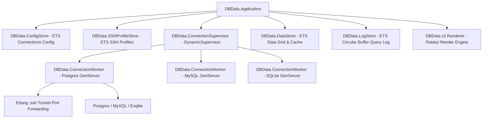

# dbdata 🗄️ — Database TUI Manager

[](LICENSE)
[](https://elixir-lang.org/)

`dbdata` là ứng dụng **Database TUI Manager** (Terminal User Interface) độc lập, hiệu năng cao cho Terminal. 

Ứng dụng kết hợp đầy đủ các tính năng quản lý Database trực quan (Quản lý kết nối DB, SSH Tunneling, Schema Navigation Tree, SQL Editor đa tab, Paginated Data Grid, và Lịch sử Query Log) với tốc độ rendering mượt mà **60 FPS** và mức tiêu thụ RAM cực nhẹ (**~25MB - 50MB**) nhờ sức mạnh của Elixir OTP và Rust Ratatui NIF engine.

---

## ✨ Features (Tính năng nổi bật)

- 🔌 **Multi-Driver Database Support**: Hỗ trợ kết nối trực tiếp **PostgreSQL** (`Postgrex`), **MySQL/MariaDB** (`MyXQL`), và **SQLite** (`Exqlite`).
- 🗝️ **SSH Tunneling System**: Tự động parse file `~/.ssh/config` và quản lý danh sách SSH Profiles riêng. Khởi tạo SSH port forwarding qua Erlang `:ssh` native để truy cập database trong mạng nội bộ/VPC bảo mật.
- ⚡ **Zero-Latency ETS Engine**: Bộ lưu trữ ETS direct-read cho Data Grid và Circular Buffer Log Store cho phép render bảng dữ liệu lớn với độ trễ siêu thấp và RAM tối ưu (< 50MB).
- 🗂️ **Schema Navigation Tree**: Duyệt cấu trúc hệ thống trực quan (Connection -> Database -> Schema -> Table/View -> Columns & Types).
- 📜 **Multi-Tab SQL Editor**: Trình soạn thảo SQL nhiều tab, tự động tô màu cú pháp (Syntax Highlighting) và phím tắt `F5` / `Ctrl+Enter` để thực thi query.
- 📊 **Paginated Data Grid**: Hiển thị bảng kết quả phân trang mượt mà, hỗ trợ di chuyển con trỏ ô, và bấm `Enter` để mở **Cell Detail Inspector** (xem & pretty print dữ liệu JSON/Text).
- 🧪 **Live Connection Testing**: Kiểm tra trực tiếp trạng thái kết nối DB & SSH handshake (**`[⚡ Test Connection]`** / **`[⚡ Test SSH]`**) ngay trong Form Modal với phản hồi trực quan màu Xanh/Đỏ.
- 📤 **Data Export & Filter**: Lọc dữ liệu nhanh theo điều kiện `WHERE`/`ORDER BY` và xuất bảng dữ liệu sang các định dạng **CSV**, **JSON**, hoặc **SQL Insert Statements**.
- 📦 **Single-Binary Distribution**: Đóng gói thành file thực thi duy nhất bằng **Burrito** (không cần cài đặt Erlang/Elixir trên máy chạy).

---

## 🏗️ Architecture



---

## 🚀 Quick Start & Installation

### Chạy từ nguồn (Development Mode)

Yêu cầu hệ thống: **Elixir 1.15+** và **Erlang OTP 26+**.

```bash
# 1. Clone repository
git clone https://github.com/quaywin/dbdata.git
cd dbdata

# 2. Cài đặt các thư viện phụ thuộc
mix deps.get

# 3. Chạy ứng dụng TUI
mix db_data
```

### Chạy Test Suite

```bash
mix test
```

### Build Binary Độc Lập (Production Release)

Tạo file thực thi đơn duy nhất bằng Burrito:

```bash
MIX_ENV=prod mix release
```

File executable sản phẩm sẽ nằm tại thư mục `burrito_out/`:
- macOS (Apple Silicon): `burrito_out/dbdata_macos_aarch64`
- macOS (Intel): `burrito_out/dbdata_macos_x86_64`
- Linux (x86_64): `burrito_out/dbdata_linux_x86_64`

---

## ⌨️ Keybindings & Controls

| Phím tắt | Phạm vi | Mô tả |
| :--- | :--- | :--- |
| `F1` / `Ctrl+1` | Global | Chuyển Focus sang Sidebar Tree |
| `F2` / `Ctrl+2` | Global | Chuyển Focus sang SQL Query Editor |
| `F5` / `Ctrl+Enter` | SQL Editor | Thực thi câu lệnh SQL hiện tại |
| `F6` | Sidebar / Data | Mở nhanh bảng dữ liệu Data Grid của Table |
| `Ctrl+N` | SQL Editor | Mở thêm Tab SQL Query mới |
| `Ctrl+W` | SQL Editor | Đóng Tab SQL Query hiện tại |
| `Ctrl+A` | Sidebar | Mở Modal Thêm kết nối DB mới |
| `Ctrl+E` | Sidebar / Data | Chỉnh sửa kết nối DB / Mở Modal Export Data |
| `Ctrl+F` / `F3` | Data Grid | Mở Modal Lọc & Sắp xếp dữ liệu (`WHERE` / `ORDER BY`) |
| `Enter` | Data Grid | Mở Modal Cell Detail Inspector (Xem JSON / Pretty Print) |
| `Tab` / `Shift+Tab` | Modals | Di chuyển qua lại giữa các ô nhập liệu và Tab |
| `Esc` / `q` | Global / Modals | Đóng Modal hoặc hủy thao tác |

---

## 📁 Directory & Configuration Layout

`dbdata` tự động lưu trữ và quản lý cấu hình độc lập tại thư mục người dùng `~/.config/dbdata/`:

```text
~/.config/dbdata/
├── connections.json     # Cấu hình danh sách kết nối Database
└── ssh_profiles.json    # Cấu hình danh sách SSH Profiles
```

---

## 📄 License

Dự án được phát hành dưới giấy phép [MIT License](LICENSE).
