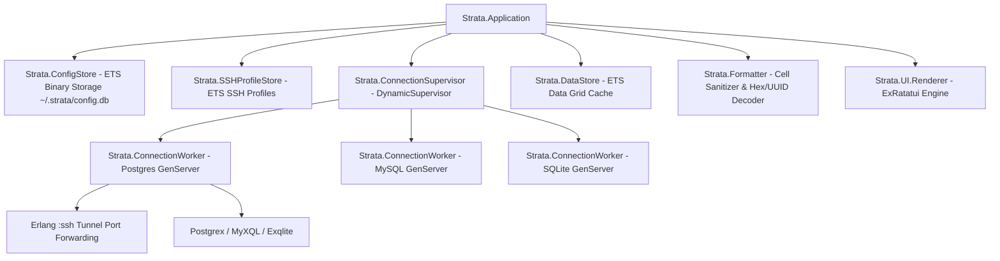

# strata 🗄️ — Modern Terminal Database Manager

[](LICENSE)
[](https://elixir-lang.org/)
[]()

`strata` là ứng dụng **Database TUI Manager** (Terminal User Interface) độc lập, hiệu năng cao cho Terminal, được thiết kế đồng bộ trải nghiệm TUI hiện đại (kế thừa các chuẩn UX tiên tiến từ `caudata`).

Ứng dụng kết hợp đầy đủ các tính năng quản lý CSDL trực quan (PostgreSQL, MySQL, SQLite, SSH Tunneling, Schema Tree, Multi-Tab SQL Editor, Dual-Mode Data Grid, và Cell Detail Inspector) với tốc độ rendering mượt mà **60 FPS** và mức tiêu thụ RAM siêu nhẹ (**~25MB - 50MB**) nhờ sức mạnh của Elixir OTP và Rust Ratatui NIF engine.

---

## ✨ Features (Tính năng nổi bật)

- 🔌 **Multi-Driver Database Support**: Hỗ trợ kết nối trực tiếp **PostgreSQL** (`Postgrex`), **MySQL/MariaDB** (`MyXQL`), và **SQLite** (`Exqlite`).
- ⚡ **Zero-Latency ETS Binary Config Storage**: Đồng bộ cơ cấu lưu trữ file ETS nhị phân (`:ets.tab2file` / `:ets.file2tab`) tại `~/.strata/config.db` (kèm fallback JSON), đảm bảo nạp dữ liệu tức thì không độ trễ.
- 🗂️ **Browsing vs Select Modes DataGrid**:
  - 📜 **Browsing Mode (Mặc định)**: Hiển thị văn bản sạch sẽ không bị viền con trỏ đè chữ. Cuộn dữ liệu tức thì từ đỉnh (Top-first) bằng phím mũi tên hoặc con lăn chuột mà không gây lệch/giật màn hình.
  - 🎯 **Select Mode**: Bật bằng phím `v`, `s`, `Enter`, `Space` hoặc nhấp chuột. Hiển thị viền con trỏ nổi bật nền vàng/xanh, hỗ trợ di chuyển từng ô, sao chép dữ liệu (`c`/`y`) và soi chi tiết.
- 🖱️ **Full Mouse & Scrollbar Support**: Nhấp chuột chọn ô/kết nối, nhấp đúp xem chi tiết, lăn chuột cuộn trang, kết hợp thanh cuộn dọc (`Scrollbar`) đồng bộ vị trí 100%.
- 🔍 **Cell Detail Inspector & Smart Formatter**:
  - Bật bằng phím `Enter`, `Space` hoặc nhấp đúp chuột.
  - 🌳 **JSON Formatting**: Tự động parse & pretty-print định dạng cây JSON đẹp mắt.
  - 🆔 **Auto 16-Byte UUID Decoding**: Tự động giải mã các mảng 16-byte nhị phân về chuỗi **UUID chuẩn** (`8-4-4-4-12`).
  - 🗂️ **Hex Dump View**: Hiển thị bảng mã Hex + ASCII cho dữ liệu nhị phân (`BLOB`, `BYTEA`, Hình ảnh).
- 🗝️ **SSH Tunneling System**: Tự động parse `~/.ssh/config` và quản lý SSH Profiles. Khởi tạo SSH port forwarding qua Erlang `:ssh` native để truy cập database trong mạng VPC bảo mật.
- 📜 **Multi-Tab SQL Editor**: Trình soạn thảo SQL nhiều tab với syntax highlighting và phím tắt `F5` / `Ctrl+Enter` thực thi query.
- 🧪 **Live Connection Testing**: Kiểm tra trực tiếp trạng thái kết nối DB & SSH handshake (**`[⚡ Test Connection]`** / **`[⚡ Test SSH]`**) với phản hồi trực quan màu Xanh/Đỏ.
- 📤 **Data Export & Filter**: Lọc dữ liệu nhanh theo điều kiện `WHERE`/`ORDER BY` và xuất bảng dữ liệu sang các định dạng **CSV**, **JSON**, hoặc **SQL Insert Statements**.
- 📦 **Single-Binary Distribution**: Đóng gói thành file thực thi duy nhất bằng **Burrito** (không cần cài đặt Erlang/Elixir trên máy mục tiêu).

---

## 🏗️ Architecture



---

## 🚀 Quick Start & Installation

### Chạy từ nguồn (Development Mode)

Yêu cầu hệ thống: **Elixir 1.15+** và **Erlang OTP 26+**.

```bash
# 1. Clone repository
git clone https://github.com/quaywin/strata.git
cd strata

# 2. Cài đặt các thư viện phụ thuộc
mix deps.get

# 3. Biên dịch dự án
mix compile

# 4. Chạy ứng dụng TUI
mix strata
```

### Chạy Test Suite

```bash
mix test
```

### Build Binary Độc Lập (Production Release)

Tạo file thực thi đơn duy nhất bằng Burrito:

```bash
MIX_ENV=prod mix release
```

File executable sản phẩm sẽ nằm tại thư mục `burrito_out/`:
- macOS (Apple Silicon): `burrito_out/strata_macos_aarch64`
- macOS (Intel): `burrito_out/strata_macos_x86_64`
- Linux (x86_64): `burrito_out/strata_linux_x86_64`

---

## ⌨️ Keybindings & Ergonomics

| Phím tắt | Phạm vi | Mô tả |
| :--- | :--- | :--- |
| `1` | Global | Chuyển sang chế độ xem **Table View** |
| `2` | Global | Chuyển sang chế độ xem **SQL Query View** |
| `3` | Global | Chuyển Focus sang **Data Grid** |
| `Tab` / `Shift+Tab` | Global / Modals | Di chuyển Focus giữa các Panel / Ô nhập liệu |
| `a` | Sidebar | Mở Modal **Thêm kết nối DB mới** |
| `e` | Sidebar / Data | Chỉnh sửa kết nối DB / Mở Modal **Export Data** |
| `f` / `/` | Data Grid | Mở Modal **Lọc & Sắp xếp dữ liệu** (`WHERE` / `ORDER BY`) |
| `v` / `s` | Data Grid | Chuyển đổi qua lại giữa **Browsing Mode** ↔ **Select Mode** |
| `Enter` / `Space` | Data Grid | Mở cửa sổ **🔍 CELL DETAIL INSPECTOR** (Xem JSON / UUID / Hex Dump) |
| `c` / `y` / `Ctrl+C` | Data Grid (Select) | Sao chép giá trị ô hiện tại |
| `↑` / `↓` / `←` / `→` | Data Grid / Tree | Di chuyển ô chọn / Cuộn danh sách |
| `PageUp` / `PageDown` | Data Grid / Modal | Cuộn trang nhanh (10 dòng) |
| `Con lăn chuột` | Data Grid / Tree | Cuộn danh sách trực quan bằng chuột |
| `Esc` / `q` | Global / Modals | Đóng Modal hoặc hủy thao tác |

---

## 📁 Storage & Configuration Layout

`strata` tự động lưu trữ cấu hình nhị phân theo chuẩn Erlang ETS tại thư mục người dùng:

```text
~/.strata/
└── config.db          # File binary ETS lưu danh sách Profiles & SSH Configurations

~/.config/strata/
└── profiles.json       # File JSON dự phòng (Dual Fallback Config)
```

---

## 📄 License

Dự án được phát hành dưới giấy phép [MIT License](LICENSE).
