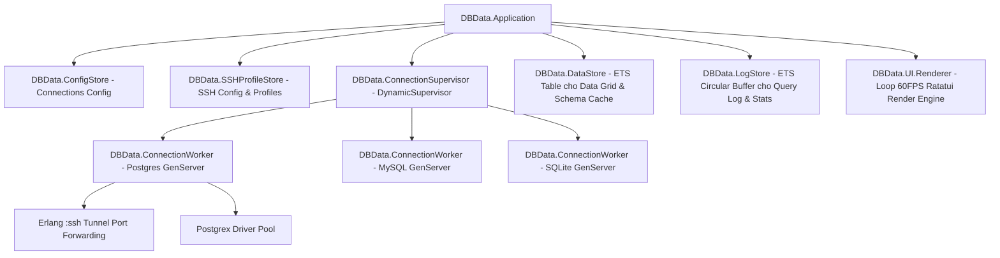

# Database TUI Application (`dbdata`) — Architecture & Design Specification

**Date:** 2026-08-05  
**Author:** Pair Programming & Antigravity  
**Status:** Approved Draft  

---

## 1. Executive Summary

`dbdata` (tên dự kiến) là ứng dụng TUI Database Manager hiệu năng cao cho Terminal, được phát triển dựa trên nền tảng kiến trúc của [Caudata](file:///Users/quaywin/Projects_1/caudata) (Multi-server Log Streamer & TUI Engine). 

Ứng dụng cung cấp các tính năng cốt lõi tương tự **DBeaver** (Quản lý kết nối DB, SSH Tunneling, Schema Navigation Tree, SQL Query Editor đa tab, Paginated Data Grid, và Lịch sử Query Log), đồng thời đạt tốc độ 60 FPS rendering mượt mà với mức tiêu thụ RAM tối ưu (~25MB - 50MB) nhờ sức mạnh của Elixir OTP và Rust Ratatui NIF engine.

---

## 2. Technology Stack

* **Core Runtime & Concurrency**: Elixir 1.19+ / Erlang OTP 28.
* **TUI Render Engine**: Rustler NIF (`ex_ratatui` / Ratatui NIF bindings từ Caudata) với SGR Mouse Event support (scroll wheel, sidebar click, footer button clicks).
* **Storage Layer**: Direct-read ETS tables (Event-driven zero-latency buffer) + JSON configuration files tại `~/.config/dbdata/`.
* **Database Drivers**:
  * PostgreSQL: `Postgrex`
  * MySQL / MariaDB: `MyXQL`
  * SQLite: `Exqlite`
* **SSH Tunneling**: Native Erlang `:ssh` application (SSH port forwarding).
* **Packaging & Distribution**: Single-binary executable via [Burrito](https://github.com/burrito-elixir/burrito) (~15MB - 20MB self-contained binary).

---

## 3. Architecture & OTP Supervisor Tree

Hệ thống tuân thủ thiết kế Supervisor Tree chịu lỗi (Fault-Tolerant) của OTP:



### Chi tiết các Supervisor & GenServers:
1. **`DBData.ConfigStore`**: Đọc/ghi cấu hình kết nối DB (`~/.config/dbdata/connections.json`) và đưa vào ETS table dạng `:set` để truy xuất $O(1)$.
2. **`DBData.SSHProfileStore`**: Parse file `~/.ssh/config` của hệ thống và quản lý danh sách SSH Profiles lưu tại `~/.config/dbdata/ssh_profiles.json`.
3. **`DBData.ConnectionSupervisor` (`DynamicSupervisor`)**: Chịu trách nhiệm khởi tạo, giám sát và đóng các `DBData.ConnectionWorker` khi người dùng kết nối hoặc ngắt kết nối DB.
4. **`DBData.ConnectionWorker` (`GenServer`)**:
   - Quản lý 1 kết nối DB cụ thể.
   - Nếu profile có `ssh_profile_id`, khởi tạo Erlang `:ssh` tunnel trước, mở forwarded local port (ví dụ: `127.0.0.1:15432` -> `remote:5432`).
   - Khởi tạo DB Driver Pool tương ứng (`Postgrex`, `MyXQL`, `Exqlite`) trỏ qua local forwarded port.
   - Thực thi các câu lệnh SQL async, hỗ trợ query timeout và query cancellation.
5. **`DBData.DataStore` (`ETS`)**: Lưu trữ bảng dữ liệu kết quả query hiện tại (Columns metadata, Rows data, Total records, Execution time). TUI đọc dữ liệu trực tiếp từ ETS để render UI trang (Pagination) mượt mà 60 FPS.
6. **`DBData.LogStore` (`ETS Circular Buffer`)**: Kế thừa trực tiếp từ Caudata `LogStore`. Lưu giữ lịch sử các câu SQL đã thực thi, thời gian phản hồi (ms), số bản ghi bị ảnh hưởng hoặc mã lỗi SQL chi tiết.

---

## 4. Connection & SSH Profiles Data Models

### Database Connection Profile (`DBData.ConnectionProfile`)
```elixir
%DBData.ConnectionProfile{
  id: String.t(),            # e.g., "pg_prod_db"
  name: String.t(),          # e.g., "Production Postgres"
  driver: :postgres | :mysql | :sqlite,
  host: String.t(),          # "127.0.0.1" hoặc remote IP/hostname
  port: integer(),           # 5432, 3306, etc.
  database: String.t(),      # Name of DB
  username: String.t(),
  password: String.t(),
  ssl: boolean(),
  ssh_profile_id: String.t() | nil  # Foreign key trỏ sang SSHProfile (nil nếu trực tiếp)
}
```

### SSH Profile (`DBData.SSHProfile`)
```elixir
%DBData.SSHProfile{
  id: String.t(),            # e.g., "prod_server_1"
  name: String.t(),          # e.g., "AWS App Server (Ubuntu 22.04)"
  host: String.t(),          # "198.51.100.42"
  port: integer(),           # 22
  username: String.t(),      # "ubuntu" / "root"
  auth_type: :password | :private_key,
  private_key_path: String.t(), # "~/.ssh/id_rsa"
  passphrase: String.t() | nil
}
```

---

## 5. UI Layout & User Interaction Flow

Giao diện TUI được thiết kế theo cấu trúc Panes đa nhiệm:

```text
┌───────────────────────────┬─────────────────────────────────────────────────────────────────────────────┐
│ 🗄️ CONNECTIONS / SCHEMA   │ 📜 SQL EDITOR (Tab 1) [Ctrl+N for new tab]                                 │
├───────────────────────────┼─────────────────────────────────────────────────────────────────────────────┤
│ 🔌 Production Postgres    │ 1 │ SELECT id, email, created_at, status                                    │
│  ├─ 📂 public             │ 2 │ FROM users                                                              │
│  │   ├─ 📋 users (12.4k)  │ 3 │ WHERE status = 'active' ORDER BY id DESC LIMIT 50;                      │
│  │   │   ├─ 🔹 id (uuid)  ├─────────────────────────────────────────────────────────────────────────────┤
│  │   │   ├─ 🔹 email      │ 📊 RESULT DATA GRID (50 rows | 12ms)                       [F5: Execute Query]│
│  │   │   └─ 🔹 status     ├──────────┬──────────────────────────┬───────────────────────┬──────────────┤
│  │   ├─ 📋 orders         │ id       │ email                    │ created_at            │ status       │
│  │   └─ 👁️ v_active_users ├──────────┼──────────────────────────┼───────────────────────┼──────────────┤
│ 🔌 Local SQLite           │ uuid-01  │ user1@example.com        │ 2026-08-01 10:00:00   │ active       │
│  └─ 📋 logs               │ uuid-02  │ user2@example.com        │ 2026-08-02 11:20:00   │ active       │
├───────────────────────────┴──────────┴──────────────────────────┴───────────────────────┴──────────────┤
│ 🪵 QUERY LOGS & CONSOLE STATS                                                                           │
│ [11:05:02] [SUCCESS] Postgres: Executed SQL (12ms, 50 rows returned)                                    │
│ [11:05:15] [ERROR] MySQL: Table 'analytics.logs' doesn't exist (Error 1146)                             │
├─────────────────────────────────────────────────────────────────────────────────────────────────────────┤
│ <F1> Connections  <F2> New SQL  <F5> Run Query  <F6> Table Data  <Ctrl+A> Add Conn  <Esc/q> Focus/Close  │
└─────────────────────────────────────────────────────────────────────────────────────────────────────────┘
```

### Main Panes:
1. **Sidebar Pane (Left)**: Tree View hiển thị Connections -> Databases -> Schemas -> Tables/Views -> Columns & Types.
2. **Top SQL Editor Pane (Right)**: Tabbed Editor hỗ trợ gõ query, syntax highlighting keywords SQL, phím tắt `F5` / `Ctrl+Enter` để thực thi.
3. **Data Grid Pane (Right Middle)**: Tabular view hiển thị kết quả query dạng lưới, hỗ trợ chuyển trang (Pagination) và nhấn `Enter` để xem chi tiết Ô (`CellDetailModal`).
4. **Log & Console Pane (Bottom)**: Hiển thị nhật ký thực thi query, thống kê ms và lỗi hệ thống real-time (kế thừa từ Caudata).

---

## 6. Comprehensive Modals & Secondary Workflows

Toàn bộ các luồng phụ và tương tác bổ trợ đều được quy hoạch thành các Overlay Modals với cơ chế Backdrop Blur/Dim của Caudata:

### 6.1. `ConnectionModal` (Tạo & Sửa Kết nối DB)
* Tab 1 (`General`): Engine (Postgres/MySQL/SQLite), Host, Port, Database Name, Username, Password, SSL mode.
* Tab 2 (`SSH Tunneling`): Dropdown chọn SSH Profile sẵn có hoặc click `[ + New SSH Profile ]` để mở lồng `SSHProfileModal`.
* Thanh Action: Nút **`[⚡ Test Connection]`** chạy thử nghiệm ping + DB auth + SSH handshake, phản hồi trạng thái Xanh/Đỏ ngay trong modal.

### 6.2. `SSHProfileModal` (Tạo & Sửa SSH Profile)
* Thông tin: Name, Host, Port (22), User, Auth Type (`Password` / `Private Key File Path`).
* Thanh Action: Nút **`[⚡ Test SSH Connection]`** thực hiện SSH handshake thử nghiệm.

### 6.3. `CellDetailModal` (Xem & Inspect dữ liệu ô)
* Kích hoạt bằng `Enter` khi đang di chuyển qua các ô trên Data Grid.
* Tự động nhận diện định dạng dữ liệu (JSON, XML, Long Text) và render Syntax Highlighting / Pretty Print.

### 6.4. `FilterSortModal` (Bộ lọc & Sắp xếp dữ liệu nhanh)
* Kích hoạt bằng `Ctrl+F` hoặc `F3` trên Data Grid.
* Cung cấp giao diện nhập điều kiện `WHERE` và cột `ORDER BY` mà không cần viết lại toàn bộ câu SQL.

### 6.5. `ExportModal` (Xuất dữ liệu)
* Kích hoạt bằng `Ctrl+E` hoặc `Ctrl+X`.
* Cho phép chọn định dạng xuất file (`CSV`, `JSON`, `SQL Insert Statements`), đường dẫn lưu file và giới hạn bản ghi (All / Current Page).

### 6.6. `ConfirmDeleteModal` (Xác nhận xóa)
* Hiển thị cảnh báo an toàn khi xóa Connection Profile hoặc SSH Profile.

---

## 7. Keybindings Registry Summary

| Keybinding | Scope | Description |
| :--- | :--- | :--- |
| `F1` / `Ctrl+1` | Global | Switch focus to Connections / Schema Sidebar |
| `F2` / `Ctrl+2` | Global | Switch focus to SQL Query Editor |
| `F5` / `Ctrl+Enter` | SQL Editor | Execute selected query or query at cursor |
| `F6` | Sidebar / Grid | Quick open table data grid |
| `Ctrl+N` | SQL Editor | Open new SQL Editor Tab |
| `Ctrl+W` | SQL Editor | Close current SQL Editor Tab |
| `Ctrl+A` | Sidebar | Add new DB Connection Profile |
| `Ctrl+E` | Sidebar / Data | Edit DB Connection Profile / Export Data |
| `Ctrl+F` / `F3` | Data Grid | Open Filter & Sort Modal |
| `Enter` | Data Grid | Open Cell Detail Inspector Modal |
| `Tab` / `Shift+Tab` | Modals | Navigate between form fields and tabs |
| `Esc` / `q` | Modals / Panes | Close active modal or return to main focus |

---

## 8. Verification & Performance Criteria

- **Memory Target**: Constant RAM usage <= 50MB khi làm việc với kết quả query hàng chục nghìn bản ghi.
- **Rendering Speed**: 60 FPS TUI layout redraw qua Ratatui NIF engine.
- **Fault Isolation**: Khi một query bị lỗi, timeout hoặc ngắt kết nối SSH, `ConnectionWorker` tự khôi phục mà không làm giật/lag giao diện TUI.

---

## 9. Next Steps

Sau khi tài liệu thiết kế này được cập nhật đầy đủ, chúng ta sẽ tiến hành chuyển sang Kế hoạch triển khai chi tiết từng bước (`writing-plans`).
